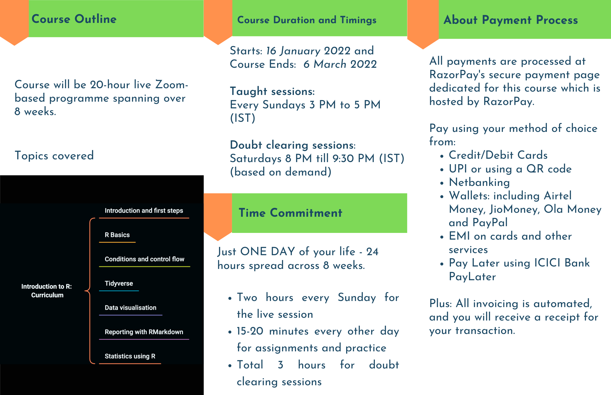

<style type="text/css">

h1.title {
  text-align: center;
}
h4.author {
  text-align: center;
}
h4.date {
  text-align: center;
}
</style>

<style>
body {
text-align: justify}
</style>

\

```{r setup, include=FALSE}
knitr::opts_chunk$set(echo = TRUE)
```

\

<center>
  <h2>
    Course Outline
  </h2>
</center>

\


<center>
[](https://rzp.io/l/introR)
[](https://rzp.io/l/introR)
[](https://rzp.io/l/introR)
</center>

\

<html>
<center>
<div class="razorpay-embed-btn" data-url="https://pages.razorpay.com/pl_HJSfkNsUyIUdjd/view" data-text="Enroll Now!" data-color="#1a61db" data-size="large">
  <script>
    (function(){
      var d=document; var x=!d.getElementById('razorpay-embed-btn-js')
      if(x){ var s=d.createElement('script'); s.defer=!0;s.id='razorpay-embed-btn-js';
      s.src='https://cdn.razorpay.com/static/embed_btn/bundle.js';d.body.appendChild(s);} else{var rzp=window['__rzp__'];
      rzp && rzp.init && rzp.init()}})();
  </script>
</div>
</center>
</html> 

\

<center>
  <h3>
    Click the button above to register. Next batch starts 16 January 2022
  </h3>
</center>

\


\


<center>
### What all can be done using R programming language?

Data visualisation, of course. Here is a DataViz

\


\

You should be able to make plots like these after completing this course (you need to put in a little effort too).

\

<center>
  <h3>
    Get in if you wish to learn the skills from this 16th!
  </h3>
</center>

\

<html>
<center>
<div class="razorpay-embed-btn" data-url="https://pages.razorpay.com/pl_HJSfkNsUyIUdjd/view" data-text="I am in!" data-color="#1a61db" data-size="large">
  <script>
    (function(){
      var d=document; var x=!d.getElementById('razorpay-embed-btn-js')
      if(x){ var s=d.createElement('script'); s.defer=!0;s.id='razorpay-embed-btn-js';
      s.src='https://cdn.razorpay.com/static/embed_btn/bundle.js';d.body.appendChild(s);} else{var rzp=window['__rzp__'];
      rzp && rzp.init && rzp.init()}})();
  </script>
</div>
</center>
</html> 

\


### Ok this is interesting, show me something more that can be done with R

Here is a data visualisation as a movie. 

\

<html>
  <center>
    <iframe src="https://player.vimeo.com/video/661628523" data-external="1" width="900" height="600"></iframe>
  </center>
</html>

\

You will be skilled enough to make animations soon after completing this course. All you have to do in pay attention in class and practice.

\

<center>
  <h3>
    Wish to make one like this all by yourself in 2022?
  </h3>
</center>

\

<html>
<center>
<div class="razorpay-embed-btn" data-url="https://pages.razorpay.com/pl_HJSfkNsUyIUdjd/view" data-text="Yes! I'm Joining Now!" data-color="#1a61db" data-size="large">
  <script>
    (function(){
      var d=document; var x=!d.getElementById('razorpay-embed-btn-js')
      if(x){ var s=d.createElement('script'); s.defer=!0;s.id='razorpay-embed-btn-js';
      s.src='https://cdn.razorpay.com/static/embed_btn/bundle.js';d.body.appendChild(s);} else{var rzp=window['__rzp__'];
      rzp && rzp.init && rzp.init()}})();
  </script>
</div>
</center>
</html> 

\

### Still not convinced, here is something more: The data sings (quite literally)

This is the above animated visualisation along with the soundtrack generated from observed data - how cool is that?

\

<html>
  <center>
    <iframe src="https://player.vimeo.com/video/660286892" data-external="1" width="900" height="600"></iframe>
  </center>
</html>

\

You should be able to make sounds with data provided you know a thing or two about music. For the R part, this course should be your starting step.

\

<center>
  <h3>
    Wish to make your data sing for you? Wish to make the world 'listen' to the data?
  </h3>
</center>

\

<html>
<center>
<div class="razorpay-embed-btn" data-url="https://pages.razorpay.com/pl_HJSfkNsUyIUdjd/view" data-text="Enroll me rightaway!" data-color="#1a61db" data-size="large">
  <script>
    (function(){
      var d=document; var x=!d.getElementById('razorpay-embed-btn-js')
      if(x){ var s=d.createElement('script'); s.defer=!0;s.id='razorpay-embed-btn-js';
      s.src='https://cdn.razorpay.com/static/embed_btn/bundle.js';d.body.appendChild(s);} else{var rzp=window['__rzp__'];
      rzp && rzp.init && rzp.init()}})();
  </script>
</div>
</center>
</html>

\

### One more final testament to R's power: This Website!

\

This website is made from scratch using R. 
From taking data from *covid19bharat.org* to 
cleaning it to carrying out quality checks to 
estimating the R vales for the nation, each state, and all available districts to
creating the tables and graphs to
rendering each webpage and the whole website
including this page yuu are viewing right now
are all done and made with R. 

Also, because of R this website is auto-updated.

All of this happens at *zero cost*. Because R! 

\


### It is hard not to fall in love with R. (Personally, I am passionate about R and hence this course). 
### Begin your love for R here, now!


\

<html>
<center>
<div class="razorpay-embed-btn" data-url="https://pages.razorpay.com/pl_HJSfkNsUyIUdjd/view" data-text="Enroll Now!" data-color="#1a61db" data-size="large">
  <script>
    (function(){
      var d=document; var x=!d.getElementById('razorpay-embed-btn-js')
      if(x){ var s=d.createElement('script'); s.defer=!0;s.id='razorpay-embed-btn-js';
      s.src='https://cdn.razorpay.com/static/embed_btn/bundle.js';d.body.appendChild(s);} else{var rzp=window['__rzp__'];
      rzp && rzp.init && rzp.init()}})();
  </script>
</div>
</center>
</html>
</center>


\

Fill out this form if you do not wish to enroll now. You will be sent a short email with a link to this page upon submission. 

\

<center>
<iframe src="https://docs.google.com/forms/d/e/1FAIpQLSfJLetf23jTOrOX34Y8YemSQmhviyiThx1FmFIYkOIvvfoAPA/viewform?embedded=true" width="900" height="300" frameborder="0" marginheight="0" marginwidth="0">Loading…</iframe>
</center>

\

Thank you for visiting this page and checking out my course. I really wish to see you in class soon!

\


\


\


\


\


\
